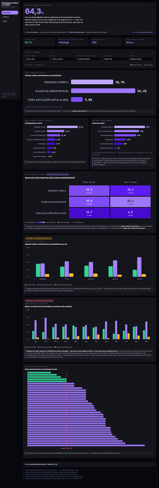
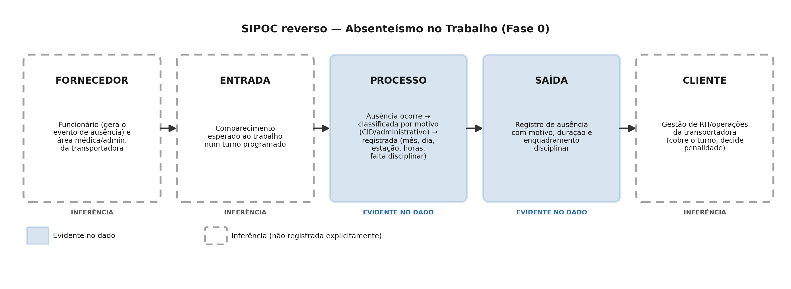
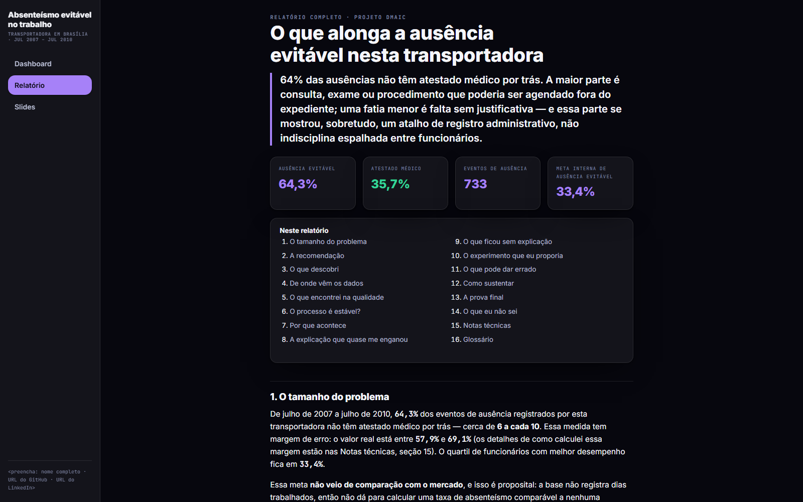
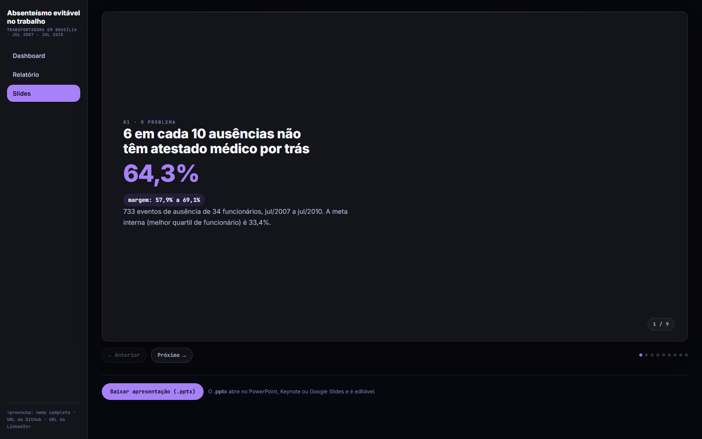

# Absenteísmo no Trabalho — o que alonga a ausência evitável

Projeto de portfólio conduzido por DMAIC (Lean Seis Sigma) sobre o dataset
público *Absenteeism at Work* (UCI Machine Learning Repository) — dados
reais de uma transportadora em Brasília, julho/2007 a julho/2010.

**Autor:** `<preencha: nome completo · URL do GitHub · URL do LinkedIn>`

📄 [Página de entrega completa](fases/fase-6-entrega/pagina/index.html) (Dashboard interativo, Relatório e Slides — baixe o repositório e abra o arquivo, ou ative o GitHub Pages deste repositório para acessar direto pelo navegador) · [Índice de todas as fases](fases/indice.md) · [Parecer da revisão por banca](fases/fase-7-revisao/)

---

## X — O tamanho do problema

> **64,3%** dos 733 eventos de ausência registrados por esta transportadora
> não têm atestado médico por trás (IC 95%: 57,9%–69,1%). O quartil de
> funcionários com melhor desempenho está em 33,4% — essa é a meta interna,
> não uma referência de mercado (a base não permite calcular uma taxa de
> absenteísmo real, por não registrar dias trabalhados).



*Dashboard interativo (modo escuro): número principal, guardrail do atestado
médico em destaque, filtros cruzados, cruzamento tipo × distância, e os
gráficos de padrão por dia da semana e por mês adicionados na revisão por
banca.*

## Por que este ângulo, e não o de sempre

Este é um dos datasets mais usados publicamente para prever "Absenteeism
time in hours" por regressão — é a abordagem que a maioria dos notebooks
públicos faz com este dataset, e não é o que este projeto faz. O ângulo
aqui é outro: variação e estabilidade do processo, decomposição
evitável/não-evitável por categoria de motivo, e o tratamento correto do
agrupamento por funcionário — as 733 linhas são ~34 funcionários com
múltiplos eventos cada, não 733 observações independentes, e ignorar isso
(como a maioria dos notebooks públicos deste dataset faz) infla
artificialmente a significância de qualquer teste.



*SIPOC reverso construído na Fase 0, para entender o processo de ausência
antes de qualquer análise — sem isso, cair na armadilha da granularidade
mista (evento vs. funcionário) seria quase certo.*

## Y — O que descobri

A ausência sem lastro médico se divide em duas partes bem diferentes:

- **54,4%** é **administrável na forma** — consulta, exame, fisioterapia,
  procedimentos que poderiam ser agendados fora do expediente.
- **9,8%** é **falta sem justificativa aceita** — e essa parte, testada
  formalmente (**H3, confirmada**), se mostrou um **atalho de registro
  administrativo disperso entre 20 funcionários** (top-5 concentram só
  48,7% dos 39 casos), não indisciplina concentrada em poucas pessoas.

Uma causa candidata para a parte administrável — **distância acima da
mediana entre residência e trabalho** — teve efeito grande (16,4 pontos
percentuais) mas **não confirmado com significância estatística** na
análise (poder de detecção de só ~3%, com 34 funcionários). A hipótese
sobreviveu ao teste de que o efeito fosse só composição de mix (rival
estrutural, testada **antes** da principal) e à checagem de concentração
por poucos funcionários. A confirmação no holdout — 8 funcionários
guardados e abertos uma única vez, no fim — mostrou a **mesma direção**
(9,5 p.p.), com intervalo de confiança muito largo: reforço qualitativo,
não confirmação estatística formal.


*Diagrama causal (Fase 3 · Analyze) — causas testáveis e não-testáveis
marcadas explicitamente, incluindo a hipótese rival estrutural testada
antes da principal (regra anti-garimpo do projeto).*

Uma revisão independente por banca (Fase 7, duas rodadas) pediu duas
checagens adicionais depois da entrega, ambas pós-hoc e sem tocar o
holdout: a concentração de "consulta médica" no ranking de horas
administráveis não vem de poucos funcionários (testada com o mesmo desenho
da hipótese rival), e a base não permite separar "distância ao trabalho" de
"distância a serviços de saúde" como explicação — limitação agora declarada
explicitamente no relatório.

## Z — O que eu recomendo (com confiança diferente para cada ação)

| Ação | Confiança | Status |
|---|---|---|
| Tirar da lista de motivos o código usado como atalho para falta sem justificativa, forçando o código oficial | **Alta** — causa confirmada (H3) | Pronta, sem custo real de implementação |
| Priorizar agendamento de consulta/exame fora do expediente para quem mora mais longe | **Condicional** — sinal promissor, não confirmado (H1) | Piloto proposto, não ativo |

A segunda ação só compensa o custo assumido de coordenação (8h de RH/mês,
premissa a substituir por um número real) se pelo menos **35,4%** dos
eventos elegíveis migrarem de fato — esse é o número que decide, não a
economia de horas prometida, porque a base não tem como confirmar o
contrafactual. Um experimento controlado formal exigiria ~550 rotas por
grupo para 80% de poder — 32 vezes mais que as 17 disponíveis nesta
operação — por isso a via de confirmação realista é o holdout observacional
(mais fraco), não um experimento novo.

**O guardrail permanente do projeto:** nenhuma das duas ações pode reduzir
a proporção de eventos com atestado médico. Se isso cair junto com a parte
evitável, é sinal de que alguém está sendo pressionado a não tirar
atestado — o oposto do objetivo, e o presenteísmo resultante custa mais
caro do que a ausência que se tentou evitar.

[Leia o relatório completo →](fases/fase-6-entrega/pagina/index.html)



*Abertura do Relatório: a mesma narrativa X-Y-Z deste README, com o rigor
técnico completo (margens de erro, testes, limitações) reunido numa seção
própria — "Notas técnicas" — para não misturar com a leitura corrida.*



*A mesma história, em formato de apresentação — 9 quadros, com exportação
para `.pptx` editável direto da página.*

---

## Origem e natureza dos dados — o que isso proíbe concluir

- **Dataset real**, de uma transportadora em Brasília, jul/2007–jul/2010
  (UCI Machine Learning Repository — [Absenteeism at Work](https://archive.ics.uci.edu/dataset/445/absenteeism+at+work)).
- **Sem coluna de ano**: qualquer leitura de sazonalidade ou tendência mensal
  é hipótese, nunca conclusão fechada — os 12 rótulos de mês misturam 3 anos
  calendário. Uma hipótese exploratória pós-hoc sobre padrão de calendário
  (Carnaval, Natal) está na página, marcada com selo próprio e nunca como
  achado confirmado.
- **Sem dias trabalhados**: não existe "taxa de absenteísmo" calculável aqui
  — toda métrica é condicional a "dado que uma ausência ocorreu".
- **Sem contrafactual**: não há registro do que deixou de acontecer (ex.:
  funcionário que teria faltado e não faltou por já ter agendado fora do
  expediente). Toda simulação de ganho usa ponto de indiferença, não ganho
  bruto, por essa razão.
- **n = 34 funcionários** (identidades com pelo menos um evento, após
  exclusões de qualidade): insuficiente para scoring de risco individual, e
  o poder estatístico disponível para testar as hipóteses de fricção de
  agendamento é de **apenas ~3%** — um resultado "não significativo" nesta
  base nunca deve ser lido como "não há efeito".

## Decisões metodológicas e por quê

- **Defeito definido em duas subcategorias**: comportamental/disciplinar
  e administrável na forma — porque a ação de RH sobre cada uma é diferente
  (processo de registro vs. agenda), e agregá-las esconderia essa diferença.
- **4 linhas excluídas no Define**: 3 registros administrativos sem evento
  real (Month of absence = 0 e 0 horas) e 1 linha do ID 29 que misturava dois
  funcionários fisicamente diferentes (Age 28 vs. 41, Height 169 vs. 182cm) —
  a mesma exclusão resolveu as duas armadilhas ao mesmo tempo.
- **Limiar de 0,30 para duplicata** (Measure 2A): das 34 linhas duplicadas
  encontradas na Fase 0, um teste de colisão por acaso (problema do
  aniversário, dado o pequeno espaço de combinações de motivo/mês/dia/duração
  observado) mostrou que 23 dos 26 grupos são coincidência plausível de
  eventos de rotina curta; 3 foram removidos como erro de digitação provável.
- **Erro-padrão agrupado por funcionário em todos os testes**: as 733
  linhas não são observações independentes — são ~34 funcionários com
  múltiplos eventos cada. Todo intervalo de confiança deste projeto vem de
  bootstrap por cluster (reamostrando funcionários inteiros, não eventos), e
  todo teste de hipótese usa permutação por funcionário — nunca a base
  tratada como 733 pessoas diferentes.

## Premissas do stakeholder simulado

Este projeto não teve cliente real. O stakeholder assumido — um gestor de
RH/operações da transportadora, que decide sobre agendamento, escala e
enquadramento disciplinar — é **simulado**. Suas premissas de decisão estão
registradas em `fases/fase-1-define/relatorio.md`. Nenhuma recomendação deste
projeto foi validada por uma pessoa real da operação.

## O que eu faria com acesso a dados reais

1. **Coluna de ano** — para separar os 3 anos calendário misturados nos
   rótulos de mês e permitir carta de controle real (mínimo 20-25 pontos).
2. **Dias trabalhados/escala** — para calcular uma taxa de absenteísmo de
   verdade, em vez de proporções condicionais a "dado que uma ausência
   ocorreu".
3. **Rota ou turno explícito** — para desenhar o experimento de confirmação
   de H1 com a unidade de aleatorização correta, em vez do proxy por
   funcionário usado aqui (que mostrou precisar de ~550 unidades para 80% de
   poder — 32 vezes mais que as ~17 disponíveis nesta base).
4. **Alguma coluna de localização além da distância ao trabalho** — para
   separar a hipótese da distância ao trabalho da explicação concorrente de
   distância a serviços de saúde, declarada como limitação não testável
   nesta rodada (achado da revisão por banca).

## Revisão independente (Fase 7 · Revisão por banca)

O projeto passou por três rodadas de revisão independente sobre a página de
entrega publicada. **Veredito final: APROVADO.** 7 achados importantes e
4 de acabamento na primeira rodada — todos corrigidos; 1 achado reaberto na
segunda rodada (uma correção de rótulo de gráfico que, medida de novo,
tinha piorado o problema que deveria resolver) — corrigido e confirmado na
terceira rodada, desta vez com medição real de sobreposição de texto, não
inspeção visual. Nenhum número sólido do projeto foi alterado por nenhuma
correção; o holdout não foi reaberto em nenhuma delas. Pareceres completos
em [`fases/fase-7-revisao/`](fases/fase-7-revisao/).

## Estrutura do projeto

- `fases/` — checkpoint de cada fase do DMAIC (relatório, manifesto,
  artefatos), com `fases/indice.md` como mapa do projeto e o registro de
  toda decisão que atravessa fases.
- `fases/fase-6-entrega/pagina/index.html` — a página de entrega final
  (Dashboard, Relatório, Slides).
- `data/raw/` — dataset original, intocado.
- `data/processed/` — bases intermediárias geradas pelo pipeline
  (`eventos_limpos.csv`, `eventos_qualidade.csv`).
- `data/holdout/` — sorteio do holdout (Fase 5), aberto uma única vez.
- `scripts/` — pipeline reprodutível, numerado por fase.
- `tests/` — testes automáticos de qualidade do dado (C7).
- `config.py` — parâmetros extraídos do código.

## Como rodar do zero

```bash
python -m venv .venv
.venv\Scripts\activate    # Windows
pip install -r requirements.txt

# reproduz o pipeline fase a fase (ordem importa)
python scripts/00_reconhecimento.py
python scripts/00b_sipoc_diagrama.py
python scripts/01_define_escopo.py
python scripts/02a_measure_qualidade.py
python scripts/02b_measure_baseline.py
python scripts/02b_graficos.py
python scripts/03_analyze.py
python scripts/03b_ishikawa.py
python scripts/03c_graficos_analyze.py
python scripts/04_improve.py
python scripts/04b_grafico_ganho.py

# testes automaticos de qualidade do dado
pytest tests/test_qualidade.py -v

# ATENCAO: os dois scripts abaixo abrem/leem o holdout. Ja foram executados
# uma unica vez na Fase 5 (semente fixa em config.py) - nao rode de novo
# esperando um resultado diferente; rodar de novo so reproduz o mesmo sorteio.
python scripts/05a_holdout_sorteio.py
python scripts/05b_holdout_confirmacao.py

# consolida os dados da pagina de entrega e gera os PDFs de cada relatorio
python scripts/06_entrega_dados.py
python scripts/md_to_pdf.py fases/fase-0-reconhecimento/relatorio.md
# (repita para as demais fases, ou veja fases/indice.md para a lista completa)
```

Parâmetros centralizados em `config.py` (limiar de duplicata, sementes de
bootstrap/permutação/holdout, custo de RH assumido na simulação de ganho).

## Uso de assistente de IA

Este projeto foi conduzido em parceria com um assistente de IA (Claude),
seguindo o método DMAIC descrito acima, com decisões de escopo, interpretação
e aceite de tollgate feitas pelo responsável do projeto a cada fase.
