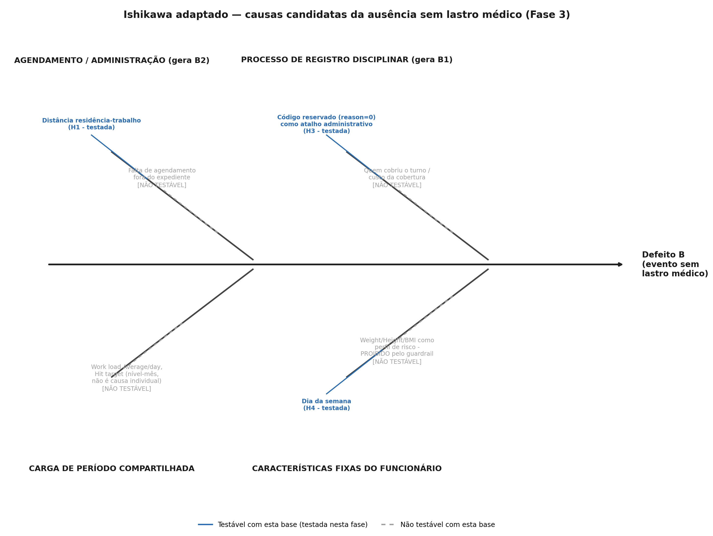

# Fase 3 · Analyze — Causa raiz — Absenteísmo no Trabalho

Data: 26/09/2026 · Janela de dados: `data/processed/eventos_qualidade.csv` (733 eventos, 34 identidades — janela de exploração, holdout fechado) · v1

## Em três linhas

Testei H2 (rival estrutural) antes de H1, como pré-registrado: o efeito de H1
**sobrevive** — não cai abaixo de 10 p.p. em nenhuma exclusão dos 3
funcionários mais frequentes, e a versão ponderada por funcionário (15,9 p.p.)
não diverge da bruta (16,4 p.p.). O efeito observado de H1 (16,4 p.p.) é
**maior que o mínimo pré-registrado, mas não cruza o α de Bonferroni**
(p=0,0178 contra α=0,0125) — dado o poder de ~3% já avisado na Fase 2B, isso é
**inconclusivo, não uma refutação**, e é o resultado mais importante da fase.
H3 não foi refutada (dispersão real entre 20 funcionários). H4 mostrou efeito
pequeno e não significativo. A maior parte do baseline de 64,26% continua sem
causa validada com confiança estatística — declarado, não suavizado. Tollgate:
**APROVADO**.

## O que foi feito

1. Ishikawa adaptado com categorias específicas deste processo, gerado também
   como imagem (`artefatos/diagrama-causal.png`/`.svg`), com testabilidade
   marcada no próprio desenho.
2. H2 (rival estrutural) testada antes de H1: exclusão dos 3 funcionários mais
   frequentes, e comparação efeito bruto vs. ponderado por funcionário.
3. H1 testada com erro-padrão agrupado por 33 clusters (funcionários com
   evento B2 ou CID), α=0,0125.
4. H3 retestada com o critério pré-registrado de concentração por ID.
5. H4 testada com agregação prévia por funcionário-dia.
6. Quantificação de quanto do baseline cada causa explica.
7. Avaliação (sem construção) de modelo de efeitos mistos.

Holdout não tocado em nenhum momento (A17).

## Decisões e por quê

### 1 · Ishikawa adaptado (A1)

*Causas testáveis nesta base (H1, H3, H4) em azul; causas que a base não
permite testar (quem cobriu o turno, Work load/Hit target como causa
individual, Weight/Height/BMI como perfil de risco — proibido pelo guardrail)
em cinza tracejado, marcadas também no texto.*

Categorias específicas deste processo (não as 6M industriais, que não fazem
sentido para um processo de ausência administrativa): agendamento/
administração (gera B2), processo de registro disciplinar (gera B1), carga de
período compartilhada (Work load/Hit target — nível-mês, não testável como
causa individual, Fase 0/2A), e características fixas do funcionário (dia da
semana testável; Weight/Height/BMI **proibidas** como perfil de risco pelo
guardrail do contexto mestre — circularidade entre si e fora do escopo deste
projeto).

### 2 · H2 — rival estrutural, testada antes de H1 (A2, A4)

**(a) Exclusão dos 3 funcionários mais frequentes** (IDs 3, 28, 34 — 113, 76 e
55 eventos totais, respectivamente): o efeito ponderado por funcionário
permanece entre **14,5 e 17,3 p.p.** em todas as três exclusões — nunca cai
abaixo do efeito mínimo pré-registrado de 10 p.p.
(`artefatos/h2_robustez_h1.png`).

**(b) Efeito bruto (16,4 p.p.) vs. ponderado por funcionário (15,9 p.p.)**: os
dois praticamente coincidem — sem sinal de Paradoxo de Simpson (A4).

**Veredito de H2**: nenhum dos dois critérios de refutação pré-registrados se
confirma (nem queda abaixo de 10 p.p., nem inversão de sinal). **H1 não é
descartada como composição de mix** — passa no teste da rival estrutural.
Isso não confirma H1 como causal (ver explicações rivais no item 6), só diz
que esta forma específica de confundimento não explica o efeito observado.

### 3 · H1 — hipótese principal, só depois de H2 (A5, A6)

H0: a proporção de funcionários "longe" (distância acima da mediana de 25,5km,
17 de 34 funcionários) é igual entre eventos B2 e eventos CID. H1: é maior
entre eventos B2.

Teste: diferença de proporções com erro-padrão agrupado por funcionário — usei
**bootstrap de cluster** para o intervalo e **permutação do rótulo
longe/perto entre os 33 funcionários com evento B2 ou CID** para o p-valor
(A6 — premissa de independência entre eventos do mesmo funcionário não vale,
por isso o reagrupamento por cluster em vez de qui-quadrado direto sobre
733 linhas).

**Resultado**: efeito observado = **16,4 p.p.** [IC 98,75% bootstrap:
0,63 a 26,4 p.p.] — maior que o efeito mínimo pré-registrado (10 p.p.).
p=0,0178 (permutação), **acima** do α de Bonferroni (0,0125)
(`artefatos/h1_efeito_ic.png`).

**Leitura obrigatória dado o poder de ~3% (Fase 2B)**: este não é um resultado
nulo. É um efeito **grande e na direção pré-registrada**, que não cruza um
limiar de significância estatisticamente exigente para um teste com pouquíssimo
poder. A frase correta é: **"a base não tem poder para confirmar H1 com
confiança, mas o padrão observado é consistente com H1 e maior que o efeito
mínimo que justificaria ação"** — não "distância não importa". Este é o
resultado mais informativo da fase, e a razão para não recomendar nada na
fase Improve com base só nele: ele precisa de confirmação na fase Control,
sobre o holdout, antes de virar decisão.

### 4 · H3 — retomada da armadilha prioritária (regra 3 do contexto mestre)

Critério pré-registrado: se ≤5 funcionários responderem por mais de 50% dos
39 eventos reason=0, H3 é refutada (comportamento concentrado). Resultado: os
39 eventos vêm de **20 funcionários distintos**, e os 5 mais frequentes somam
**48,72%** — abaixo do limiar de 50%. **H3 não é refutada**: a dispersão é
consistente com um código usado administrativamente por muitos funcionários
diferentes (o "atalho" de reason=0 para falta disciplinar), não com um padrão
de reincidência concentrado em poucos indivíduos.

**Nota de honestidade (regra 9, ligada à nota de processo da Fase 1)**: o
número de 48,72% coincide com um cálculo que eu havia inadvertidamente feito
durante o Define, antes do pré-registro estar congelado, e que removi do
script naquele momento sem usar o valor (Fase 1, item 5). Registrar isso de
novo aqui: o **critério de refutação** (≤5 IDs, >50%) foi fixado no
pré-registro de forma independente desse número específico — é um limiar
redondo e defensável por si (maioria simples do topo-5), não calibrado a
partir do valor observado. Ainda assim, o fato de eu já ter visto o número
antes reduz um pouco a força confirmatória desta hipótese em particular, e
isso fica declarado, não escondido.

**Consequência para a leitura de B1**: como H3 não foi refutada, a leitura
correta é que o padrão reason=0 é **mais provavelmente um atalho
administrativo disperso do processo de registro** do que uma característica
de poucos funcionários problemáticos. Nenhuma conclusão sobre "quais
funcionários" deve ser apresentada como achado — seria tratar um artefato de
construção (o código 0 sendo usado fora da lista oficial do UCI) como
descoberta sobre comportamento (A16).

### 5 · H4 — dia da semana, com agregação por funcionário-dia

Para não deixar funcionários com muitos eventos dominarem o teste, calculei,
para cada um dos 33 funcionários com eventos B e CID, a proporção de **seus
próprios** eventos B que caem em segunda ou sexta, e a mesma proporção para
seus eventos CID — depois comparei a média dessas diferenças individuais
(cada funcionário conta uma vez).

**Resultado**: efeito médio = **3,95 p.p.** [IC 98,75%: -11,7 a 20,6 p.p.],
muito abaixo do efeito mínimo pré-registrado de 8 p.p., p=0,555 — o intervalo
cobre folgadamente o zero, e mesmo o ponto central fica abaixo do que
justificaria ação (`artefatos/h4_efeito_ic.png`). **H4 não é sustentada**: ao
contrário de H1, aqui nem a magnitude do efeito observado se aproxima do
mínimo prático — isso é mais parecido com "não há padrão" do que com "poder
insuficiente para ver um padrão real", ainda que o poder baixo continue
valendo tecnicamente para os dois.

### 6 · Explicações rivais (A8, A9, A16)

**Causalidade reversa para H1** (nomeada no prompt, avaliada aqui): é possível
que funcionários que já geravam mais eventos evitáveis — por características
observadas ou não pela gestão antes desta base começar — tenham sido alocados
a rotas mais distantes por decisão administrativa prévia, e não o contrário.
Esta base **não tem como descartar isso**: não há data de alocação de rota,
nem histórico anterior a jul/2007. A direção mais plausível dado o processo
descrito na Fase 0 (rotas são atribuídas pela operação, não escolhidas pelo
funcionário) não pode ser decidida só com estes dados.

**Variável omitida** (A8): características do cargo ou do turno (não
registradas) podem determinar tanto a distância da rota quanto a facilidade de
agendar consultas fora do expediente — um confundidor que empurraria o efeito
observado para cima (se cargos com rotas longas também tiverem menos
flexibilidade de horário) ou para baixo (direção oposta), sem como saber qual.

**O que faria eu abandonar H1**: se o efeito ponderado por funcionário (item
2b) fosse pequeno ou invertesse — não aconteceu — ou se a causalidade reversa
fosse mecanicamente mais plausível que a direção pré-registrada. Como o
processo da Fase 0 sugere que a rota é definida pela operação antes de
qualquer histórico de ausência do funcionário na base (rotas não mudam por
evento individual, até onde o SIPOC reverso permite inferir), a direção
pré-registrada (distância → fricção de agendamento → evento B2) continua mais
plausível que a reversa — mas isso é [INFERÊNCIA], não confirmação.

### 7 · Quantificação (A15)

Do baseline de **64,26%** de eventos B (≈13,1 eventos/mês, aproximação de 36
meses):

| Causa | Explica com confiança? | Observação |
|---|---|---|
| H1 (distância) | **Não, com confiança estatística** — mas efeito observado (16,4 p.p.) é grande e sobreviveu à rival estrutural | Candidato mais forte para investigação futura/experimento (fase Improve/Control) |
| H2 (composição de mix) | Testada e não confirmada como explicação alternativa de H1 | Não é uma causa em si — é o teste que valida (parcialmente) H1 |
| H3 (artefato de registro) | **Sim, com o critério pré-registrado** — dispersão entre 20 funcionários | Explica a *natureza* dos 72 eventos B1 (9,82% do baseline), não sua *causa raiz* individual |
| H4 (dia da semana) | **Não** — efeito pequeno, abaixo do mínimo prático | Descartada como explicação relevante |

**Quanto fica sem explicação causal validada**: a esmagadora maioria do
baseline. Dado o poder de ~3%, isso é esperado, não uma falha de execução — e
é dito aqui com a mesma transparência dos relatórios anteriores. O achado
central real desta fase não é "por que a ausência evitável acontece", mas
**a decomposição evitável/não-evitável em si, feita com o rigor de
granularidade da Fase 0**, mais o achado de que H1 é promissora o bastante
para justificar confirmação formal na Control — não uma lista de causas
provadas.

### 8 · Modelagem — avaliada, não construída (A14, regra 8 do contexto mestre)

Considerei um modelo de efeitos mistos (intercepto aleatório por funcionário)
para decompor variância entre-funcionário vs. dentro-funcionário do defeito B.
**Decisão: não construir.** A subamostragem da tarefa 2 (exclusão dos 3 mais
frequentes) e a comparação bruto/ponderado já respondem à pergunta que o
modelo resolveria aqui — se a composição de mix explica H1 — e o resultado
(H1 sobrevive) não mudaria com um modelo mais complexo, porque "Distance from
Residence to Work" é constante por funcionário: um efeito aleatório por
funcionário absorveria a própria variável de interesse, não a separaria dela.
Um modelo misto teria valor se a pergunta fosse sobre uma variável que varia
dentro do funcionário (ex.: Work load Average/day, que já sabemos ser de
nível-mês) — não é o caso de H1. Construir o modelo só para "ter modelo" violaria
a regra 8 (análise mais simples que responde à pergunta).

## Registro de escolhas

| Escolha | O que usei | O que mais considerei | Por que esta | Evidência | Regra |
|---|---|---|---|---|---|
| Teste de H1 | Bootstrap de cluster (IC) + permutação por funcionário (p-valor) | Qui-quadrado direto sobre 733 eventos | Qui-quadrado trataria eventos do mesmo funcionário como independentes, inflando artificialmente a significância — violaria a regra de granularidade | `artefatos/analyze.json`, `H1_teste` | A6, granularidade do contexto mestre |
| Agregação de H4 | Média das diferenças por funcionário (cada um conta 1 vez) | Pool de todos os eventos, ponderado por frequência | Funcionários com muitos eventos dominariam a proporção pool; a agregação por funcionário-dia era exigência do prompt e evita esse viés | `artefatos/analyze.json`, `H4_teste` | granularidade do contexto mestre |
| Modelo de efeitos mistos | Não construído | Construir para "checar" H1 de outro ângulo | A variável de interesse (Distance) é constante por funcionário — um efeito aleatório por funcionário absorveria a própria variável testada, não isolaria composição de mix melhor que a subamostragem já feita | Item 8 deste relatório | A14, regra 8 do contexto mestre |

## Números

Todos os números vêm de `artefatos/analyze.json`, gerado por
`scripts/03_analyze.py` a partir de `data/processed/eventos_qualidade.csv`.
Gráficos em `artefatos/*.png`, gerados por `scripts/03c_graficos_analyze.py`
(H1, H2) e `scripts/03b_ishikawa.py` (diagrama causal).

## Tollgate ANALYZE

| Critério | Veredito | Motivo |
|---|---|---|
| H2 testada antes de H1, com os dois testes específicos do pré-registro | OK | Exclusão dos 3 mais frequentes e bruto vs. ponderado — nenhum critério de refutação se confirma |
| Todo teste com efeito + IC, "não significativo" nunca lido como refutação sem citar o poder | OK | H1 relatado como inconclusivo (efeito grande, p acima de α), não como nulo — item 3 |
| H3 com veredito pelo critério de concentração (≤5 IDs / >50%) | OK | 48,72% em 20 IDs — não refutada, com a nota de honestidade sobre o número já visto na Fase 1 |
| H4 com agregação por funcionário-dia antes do teste | OK | Item 5 |
| Causalidade reversa nomeada e avaliada concretamente para H1 | OK | Item 6 — mecanismo específico (alocação de rota), não genérico |
| Ishikawa como imagem, com etapas não-testáveis marcadas no desenho | OK | `artefatos/diagrama-causal.png`, causas cinza tracejado rotuladas [NÃO TESTÁVEL] |
| Quantificação declara o que fica sem explicação | OK | Item 7 — maioria do baseline permanece sem causa validada, declarado sem suavizar |

**Veredito: APROVADO.**

## Pendências e riscos

- H1 é o candidato mais forte para a fase Improve, mas **não pode virar
  recomendação sem a confirmação formal no holdout** (fase Control) — o
  resultado aqui é promissor, não decisivo.
- A causalidade reversa para H1 (alocação de rota) não pode ser descartada com
  esta base — deve aparecer como limitação sempre que H1 for mencionada.
- O achado de honestidade sobre H3 (número já visto na Fase 1) deve ser
  citado no README como uma limitação metodológica menor, não escondido.

## Para a próxima fase

O Improve recebe: H1 como candidato promissor (16,4 p.p., não confirmado com
confiança, sobrevivente à rival estrutural) para desenhar uma recomendação e
um experimento de confirmação — não uma recomendação definitiva. H3 como
achado confirmado (artefato de registro disperso) que deveria virar uma
correção de processo administrativo (usar o código 26 em vez do código 0 para
falta disciplinar), não uma ação sobre funcionários específicos. H4 descartada.
O holdout continua fechado, a ser aberto só na fase Control para testar H1
formalmente.
