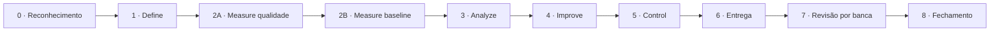

# Absenteísmo no Trabalho — o que alonga a ausência evitável

| Fase | Status | Tollgate | Relatório | Data |
|---|---|---|---|---|
| 0 · Reconhecimento | concluída | APROVADO com ressalvas | [relatório](fase-0-reconhecimento/relatorio.pdf) | 26/09/2026 |
| 1 · Define | concluída | APROVADO | [relatório](fase-1-define/relatorio.pdf) · [pré-registro](fase-1-define/pre-registro.pdf) | 26/09/2026 |
| 2A · Measure — qualidade | concluída | APROVADO | [relatório](fase-2a-measure-qualidade/relatorio.pdf) | 26/09/2026 |
| 2B · Measure — baseline | concluída | APROVADO | [relatório](fase-2b-measure-baseline/relatorio.pdf) · [baseline congelado](fase-2b-measure-baseline/baseline-congelado.pdf) | 26/09/2026 |
| 3 · Analyze | concluída | APROVADO | [relatório](fase-3-analyze/relatorio.pdf) | 26/09/2026 |
| 4 · Improve | concluída | APROVADO | [relatório](fase-4-improve/relatorio.pdf) | 26/09/2026 |
| 5 · Control | concluída | APROVADO com ressalva | [relatório](fase-5-control/relatorio.pdf) | 26/09/2026 |
| 6 · Entrega | concluída | APROVADO (v5 — reconstrução do zero: sem Painel, sem registro dual, navegação lateral) | [relatório](fase-6-entrega/relatorio.pdf) · [página](fase-6-entrega/pagina/index.html) | 27/09/2026 |
| 7 · Revisão por banca | concluída (3 rodadas + correções aplicadas) | APROVADO | [parecer r1](fase-7-revisao/parecer.pdf) · [parecer r2](fase-7-revisao/parecer-r2.pdf) · [parecer r3](fase-7-revisao/parecer-r3.pdf) · [correções](fase-7-revisao/correcoes.md) | 28/09/2026 |
| 8 · Fechamento | não iniciada | — | — | — |

## Fluxo

## Decisões que atravessam o projeto

| Decisão | Fase de origem | O que muda nas fases seguintes |
|---|---|---|
| Granularidade mista confirmada: linha = evento de ausência, não funcionário | Fase 0 | Qualquer estatística por funcionário precisa de erro-padrão agrupado por ID, efeitos mistos, ou agregação prévia |
| ID 29 mistura duas pessoas fisicamente diferentes (Age, Height, Weight incompatíveis) | Fase 0 | Define precisa decidir: dividir em 29a/29b, ou excluir a linha minoritária. Holdout aleatório por ID depende dessa decisão |
| Work load Average/day e Hit target são de nível-mês/empresa, não de funcionário | Fase 0 | Não usar como atributo por linha sem tratar como efeito de período compartilhado |
| BMI é aritmeticamente derivado de Weight e Height (resíduo < 1 em 98,6% das linhas) | Fase 0 | As três colunas contam como uma evidência só — nunca preditores concorrentes |
| Defeito candidato recomendado: B — ausência sem lastro médico (Reason for absence fora dos capítulos CID 1–21) | Fase 0 | Define precisa fechar a fronteira entre "comportamental" (26, disciplinar) e "administrável" (consultas/exames) dentro do candidato B |
| 34 linhas duplicadas exatas, concentradas em 9 IDs | Fase 0 | Measure 2A decide se são coincidência plausível ou erro de digitação, e o tratamento de cada caso |
| Crise financeira 2008–2009 (Selic 13,75%→8,75%; PIB -3,6% no 4º tri/2008) não é testável nesta base por falta de coluna de ano | Fase 0 | Só entra como explicação rival qualitativa no Analyze, nunca como achado |
| Holdout: aleatório estratificado por ID de funcionário (mais fraco que corte temporal) | Contexto mestre | Proibido antes da fase Control |
| Defeito B fechado em duas subcategorias — B1 comportamental/disciplinar (Reason 0,26) e B2 administrável na forma (Reason 22,23,24,25,27,28) — cada uma com Pareto separado | Fase 1 · Define | Measure 2B mede as duas separadamente; Improve recomenda ações diferentes para cada uma |
| Excluídas 4 linhas: 3 administrativas sem evento real (IDs 4, 8, 35) + 1 linha corrompida do ID 29 (resolve a armadilha de granularidade E o padrão reason=0/0h ao mesmo tempo) | Fase 1 · Define | População de evento passa de 740 para 736; identidades de funcionário de 36 para 34 (IDs 4 e 35 tinham só essa linha) |
| Métrica primária: proporção de eventos (contagem). Horas: métrica secundária/guardrail, nunca somada à contagem | Fase 1 · Define | Baseline da Fase 2B mede proporção com IC; horas reportadas separadamente por subcategoria |
| 4 hipóteses pré-registradas e imutáveis em fase-1-define/pre-registro.md (H1 principal, H2 rival estrutural, H3 artefato de registro, H4 dia da semana) — correção Bonferroni, α=0,0125 | Fase 1 · Define | Analyze testa exatamente estas 4, nesta ordem (H2 antes de H1), nenhuma nova hipótese pode ser adicionada depois |
| Holdout: aleatório por identidade de funcionário (34 identidades pós-exclusão), 75/25, semente fixa — ainda não materializado em arquivo | Fase 1 · Define | Control sorteia e congela; nenhum script antes disso pode gerar esse recorte |
| **Correção (adendo datado):** pre-registro.md original citava "36 identidades" por engano; corrigido para 34, com o split do holdout ajustado para ~26/8 (não 27/9) | Fase 1 · Define — adendo de 26/09/2026 | Sorteio do holdout na Control deve usar 34 identidades e a proporção ~26/8, conforme o adendo em pre-registro.md |
| Duplicatas resolvidas com modelo de colisão por acaso (limiar p<0,30): 23/26 grupos mantidos (coincidência plausível), 3 removidos (erro de digitação provável) | Fase 2A · Measure | Base final = `data/processed/eventos_qualidade.csv` (733 eventos, 34 identidades) — usar esta base a partir da Fase 2B, não mais `eventos_limpos.csv` |
| Regra travada: Weight e Height são as colunas-fonte; Body mass index é derivada — nunca as três como preditores concorrentes | Fase 2A · Measure | Vale para Analyze e qualquer modelagem futura |
| Erro indetectável nomeado: Reason for absence por conveniência (ex. falta disciplinar lançada como consulta médica) não deixa rastro estrutural — adjacente à hipótese H3 | Fase 2A · Measure | Se H3 for refutada no Analyze, este erro indetectável vira explicação alternativa a mencionar no README |
| Baseline congelado: proporção de eventos B = 64,26% [57,95%;69,13%] IC por bootstrap de 34 clusters (não Wilson ingênuo sobre 733 eventos) | Fase 2B · Measure — imutável | Improve e Control medem ganho contra este número; nenhuma fase pode recalcular o baseline |
| Sem carta de controle por regra (M11: máximo 13 pontos possíveis) — tabela descritiva não temporal no lugar | Fase 2B · Measure | Nenhuma leitura de "mês" pode virar conclusão de tendência ou sazonalidade |
| Pareto de impacto em horas só cobre B2 (6 códigos) — B1 tem 100% dos eventos com 0h e usa o Pareto de taxa como régua | Fase 2B · Measure | Toda menção a B1 daqui em diante precisa citar contagem de eventos, nunca horas, como medida de impacto |
| Poder estatístico muito baixo para H1 e H4 (~3%, n efetivo=34 funcionários) | Fase 2B · Measure | Analyze deve reportar efeito+IC, nunca só p-valor; "não significativo" é inconclusivo, não refutação |
| Correção: relatorio.md da Fase 1 tinha erro de digitação na soma B1+B2 (54,4%→64,4%) — corrigido diretamente (não é artefato imutável) | Fase 2B · Measure | Nenhuma decisão do Define mudou; só a prosa do número preliminar |
| H2 (rival estrutural) não refuta H1: efeito de 16,4 p.p. sobrevive à exclusão dos 3 funcionários mais frequentes e à ponderação por funcionário | Fase 3 · Analyze | H1 segue candidata para Improve/Control — não descartada como composição de mix |
| H1: efeito grande (16,4 p.p., > mínimo de 10 p.p.) mas não significativo no α=0,0125 (p=0,0178) — dado o poder ~3%, é INCONCLUSIVO, não refutação | Fase 3 · Analyze | Nenhuma recomendação da Improve pode tratar H1 como confirmada; precisa de confirmação formal no holdout (Control) |
| H3 não refutada: 39 eventos reason=0 vêm de 20 funcionários, top-5 concentram 48,72% (<50%) — consistente com atalho administrativo disperso, não comportamento concentrado | Fase 3 · Analyze | B1 deve ser tratado como correção de processo (usar código 26, não 0, para falta disciplinar), não como ação sobre funcionários específicos |
| H4 descartada: efeito de 3,95 p.p., abaixo do mínimo de 8 p.p., p=0,555 | Fase 3 · Analyze | Dia da semana não entra como fator na Improve |
| Causalidade reversa para H1 (rota alocada por gestão antes do histórico de ausência) não pode ser descartada com esta base | Fase 3 · Analyze | Toda menção a H1 no README/Entrega precisa citar este limite |
| H3: recomendação firme (poka-yoke) — eliminar código 0 da lista de motivos, forçar uso do código 26 para falta disciplinar | Fase 4 · Improve | Entra no plano de controle da Control como regra de sistema pronta |
| H1: recomendação condicional/piloto — política de agendamento priorizando distância > 25,5km, NÃO ativa até confirmação | Fase 4 · Improve | Control decide se confirma via holdout; Entrega deve marcar como piloto, nunca como decisão tomada |
| Ponto de indiferença de H1: 35,4% de adesão para empatar com custo de RH assumido (8h/mês, premissa ilustrativa) | Fase 4 · Improve | Número principal da recomendação — não o ganho bruto; substituir premissa por dado real antes de decisão de negócio |
| Experimento formal de H1 (rota como unidade) exigiria ~550 unidades/grupo para 80% de poder — 32x mais que as 17 disponíveis | Fase 4 · Improve | Experimento controlado inviável nesta operação; via realista é o holdout observacional (mais fraco) da Control |
| Guardrail do experimento: nenhuma queda em B2 pode vir com queda em CID (sinalizaria supressão de atestado médico) | Fase 4 · Improve | Critério de aceite obrigatório em qualquer avaliação de H1 na Control |
| **HOLDOUT ABERTO** (semente 20260926, 26 exploração/8 confirmação): efeito de H1 na confirmação = 9,48 p.p. [IC 95% 0,0-32,2], mesma direção que a exploração (16,4 p.p.), IC muito largo | Fase 5 · Control | Reforço qualitativo, NÃO confirmação estatística — piloto de H1 continua condicional, sem mudança de status |
| Decisão final sobre H1: não implementar como regra ativa; continuar coletando dados ou aceitar piloto informal com monitoramento cuidadoso do guardrail CID | Fase 5 · Control | Entrega/README devem apresentar H1 como candidato não confirmado, nunca como achado decidido |
| 14 testes automáticos de qualidade (tests/test_qualidade.py) travam forma, domínio e volume (733 eventos, 34 identidades) da base final | Fase 5 · Control | Qualquer mudança futura no dado de entrada que quebre esses testes exige investigação antes de reusar os resultados |
| Pendência de reprodutibilidade: requirements.txt sem versões pinadas; scripts das Fases 2A-4 não importam config.py (constantes duplicadas) | Fase 5 · Control | Resolver antes de reexecutar o pipeline em outra máquina/ambiente |
| Página de entrega publicada (fases/fase-6-entrega/pagina/index.html): Painel, Dashboard, Relatório e Slides, com nomenclatura descritiva (sem B1/B2/CID fora do glossário) | Fase 6 · Entrega | É a fonte oficial de apresentação do projeto — Fase 7 (banca) recebe só o link, sem os bastidores |
| Auditoria com navegador real (Playwright): 3 rodadas, 3 rótulos de gráfico corrigidos na rodada 2, rodada 3 limpa | Fase 6 · Entrega | Relatório completo em fases/fase-6-entrega/artefatos/relatorio-auditoria.md |
| v2 — identidade visual pelo Montador de Dashboards: Template Clínica médica, Estilo Dark Glass, Layout Painel de controle, 5 Peças (Número-herói, Faixa de KPIs, Pareto, Barras agrupadas, Tabela densa). Nenhum número recalculado | Fase 6 · Entrega — v2, 27/09/2026 | Justificativas em fase-6-entrega/artefatos/escolhas-visuais.md; 1 defeito de contraste (texto sobre botão de acento) encontrado e corrigido, documentado na Rodada 4 de relatorio-auditoria.md |
| v3 — a v2 só recolorira Dashboard/Relatório/Slides sobre o molde antigo da skill; corrigido tratando o HTML do Montador como molde estrutural real (grade de 12 colunas, cartão de vidro, chips arredondados) nos 4 modos, não só no Painel. Nenhum número recalculado | Fase 6 · Entrega — v3, 27/09/2026 | Mudança estrutural por modo registrada em fase-6-entrega/artefatos/escolhas-visuais.md (adendo v3); Rodada 5 de relatorio-auditoria.md, 0 achados |
| v4 — a v3 ainda recriava o Painel com os componentes desta skill usando as cores do arquivo; corrigido enxertando a marcação real de artefatos/montador-clinica-aurora-operacao.html (grade, blocos, os 2 gráficos no motor ECharts original do arquivo), populada com os dados do pipeline. Dashboard/Relatório/Slides intocados. Nenhum número recalculado | Fase 6 · Entrega — v4, 27/09/2026 | Adendo v4 em escolhas-visuais.md; 3 defeitos visuais achados e corrigidos na Rodada 6 de relatorio-auditoria.md (rótulos do Pareto, "80%" duplicado, fundo do cabeçalho da tabela) |
| Fase 6 apagada por completo (v1-v4) e reconstruída do zero (v5) por decisão do usuário: sem modo Painel, sem registro Simples/Técnica (um só registro, em linguagem simples; rigor técnico reunido em seção "Notas técnicas"), navegação e filtros numa lateral fixa (filtros só ativos no Dashboard), cada gráfico do Dashboard com frase de leitura. Downloads/auditoria/X-Y-Z mantidos | Fase 6 · Entrega — v5, 27/09/2026 | Commits v1-v4 seguem no histórico como registro do que foi tentado; scripts/06_entrega_dados.py sobreviveu à limpeza (vive fora de fases/fase-6-entrega/) e foi reexecutado sem mudar nenhum número |
| Banca (rodada 1) sobre `fases/fase-6-entrega/artefatos/index.html`: 0 críticos, 7 importantes (I1-I7), 4 menores (M1-M4) — nenhum muda o número principal ou a recomendação | Fase 7 · Revisão por banca, 27/09/2026 | Todos os achados aguardam decisão do responsável antes de correção; parecer completo em fase-7-revisao/parecer.md, prompt pronto em fase-7-revisao/prompt-correcao.md |
| I7 (adendo, 27/09/2026): trocar a tabela bruta do Dashboard por gráficos de padrão por dia da semana e mês — dia da semana é descritivo seguro (H4 já testada e descartada); mês×calendário (Carnaval/Natal) é hipótese nova pós-hoc, holdout já aberto desde a Fase 5 | Fase 7 · Revisão por banca — adendo, 27/09/2026 | Se implementado, qualquer leitura de mês×calendário entra como exploratória, nunca como achado confirmado ou nova recomendação de negócio |
| Correções da banca (I1-I7, M1-M4) executadas e verificadas: I2 (consulta médica não concentrada em poucos funcionários, testado com desenho de H2), I3 (limitação de proxy de saúde declarada), I7 implementado (H5 calendário, exploratória, com selo próprio) — nenhum número sólido do projeto mudou; holdout não tocado | Fase 7 · Revisão por banca — correções, 27/09/2026 | Detalhe item a item em fase-7-revisao/correcoes.md; adendo pós-hoc de I2/I3 em fase-3-analyze/relatorio-v2.md; auditoria Rodada 7 (23/23, 0 achados) em fase-6-entrega/artefatos/relatorio-auditoria.md |
| I4 aplicado com placeholder (`<preencha: nome completo · URL do GitHub · URL do LinkedIn>`) — dados reais do autor não disponíveis nesta conversa | Fase 7 · Revisão por banca — correções, 27/09/2026 | Pendência: substituir o placeholder na página (lateral, 3 modos) e no README antes de publicar |
| **I4 resolvido**: placeholder substituído por Matheus Augusto da Silva, GitHub e LinkedIn reais — página (lateral, 3 modos) e README | Fase 8 · Fechamento, 28/09/2026 | Nenhuma pendência humana restante antes de publicar |
| Banca (rodada 2, 28/09/2026): conferidos os 7 achados importantes e os 4 menores da rodada 1. 6/7 importantes confirmados resolvidos (I2, I3, I5, I6, I7 — I7 além do pedido, com cálculo das datas de Carnaval); I4 segue pendência humana esperada. **I1 (sobreposição do Pareto de horas) reaberto: a correção trocou rótulos abreviados por nomes completos e piorou a sobreposição (2→4 colisões)** | Fase 7 · Revisão por banca — rodada 2, 28/09/2026 | Correção de I1 precisa testar sobreposição de novo após o ajuste, não só validar visualmente; parecer completo em fase-7-revisao/parecer-r2.md |
| M5 (rodada 2, sugestão do responsável, aceita pela banca): mover o bloco "Por funcionário" do Dashboard para o fim, depois dos gráficos de dia/mês e antes da tabela detalhada — corrige a progressão agregado→granular | Fase 7 · Revisão por banca — rodada 2, adendo, 28/09/2026 | Aplicar junto com a correção de I1; replicar a mesma ordem no Relatório se a seção 3 espelhar a sequência do Dashboard |
| I1 corrigido de fato na rodada 2: a correção da rodada 1 tinha piorado a sobreposição (2→4 colisões, nomes completos a -38° não cabiam). Corrigido com abreviação (última palavra, não a segunda) + rotação -60° + gráfico mais largo — 0 colisões medidas por `getBoundingClientRect()`, não inspeção visual, nos 3 cenários (claro, escuro, celular) | Fase 7 · Revisão por banca — rodada 2, 28/09/2026 | Lição registrada: sobreposição de rótulo rotacionado exige medição de retângulo, nunca só captura de tela — `fase-6-entrega/artefatos/checagem_sobreposicao_i1.py` fica como padrão reutilizável |
| M5 aplicado: ordem do Dashboard passou a ser motivo → tempo perdido → distância → dia da semana → mês → por funcionário → tabela. Relatório não tinha bloco equivalente a "por funcionário" — nada para reordenar lá | Fase 7 · Revisão por banca — rodada 2, 28/09/2026 | Nenhuma mudança de número, só posição visual |
| Banca (rodada 3, checagem final, 28/09/2026): confirmados I1 (0 ocorrências em `sobreposicao.md` nos 7 cenários testados) e M5 (ordem do Dashboard bate com o pedido) — nada quebrou. Veredito: APROVADO, sem ressalvas pendentes de correção pela banca | Fase 7 · Revisão por banca — rodada 3, 28/09/2026 | Parecer em fase-7-revisao/parecer-r3.md/.pdf. Só restam pendências humanas fora do escopo da banca: I4 (dados reais de autoria) |
